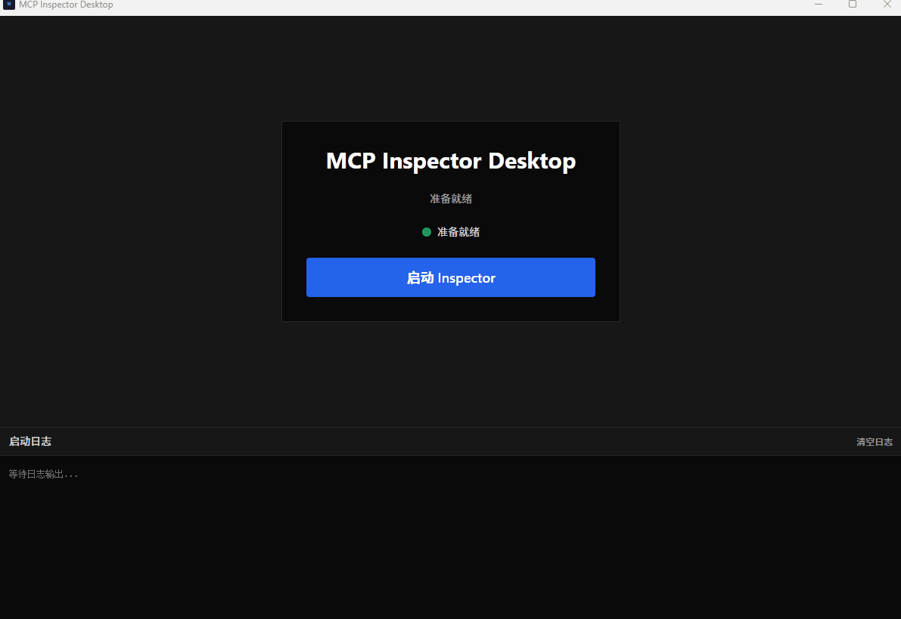

# MCP Inspector Desktop

> 为 [MCP Inspector](https://github.com/modelcontextprotocol/inspector) 打造的原生桌面封装——告别浏览器标签，一键调试 MCP Server。

[](https://github.com/cicbyte/mcp-inspector-desktop/actions/workflows/release.yml)


[English](README.en.md) | **中文**



## 功能特性

- **原生桌面体验** — 将 MCP Inspector 完整嵌入桌面窗口，无需切换浏览器
- **一键启停** — 简洁界面控制 Inspector 进程生命周期，状态一目了然
- **实时日志面板** — 底部可收起日志面板，彩色区分系统消息、标准输出与错误
- **自动端口分配** — 智能选择可用端口，杜绝端口冲突
- **认证令牌自动捕获** — 解析 CLI 输出，自动提取 Session Token 并组装完整 URL
- **跨平台** — 同时支持 Windows、macOS（Intel & Apple Silicon）和 Linux

## 运行截图

**启动页**


**Inspector 运行界面**


## 安装

### 从 Release 下载

前往 [Releases](https://github.com/cicbyte/mcp-inspector-desktop/releases) 页面下载对应平台的安装包：

| 平台 | 格式 |
|------|------|
| Windows | `.exe` / `.msi` |
| macOS | `.dmg`（Universal Binary） |
| Linux | `.AppImage` / `.deb` / `.rpm` |

### 前置要求

- **Node.js** v18+
- **Rust** 1.70+
- **系统依赖**：
  - Windows: [WebView2](https://developer.microsoft.com/en-us/microsoft-edge/webview2/)
  - Linux: `libwebkit2gtk-4.1-dev`
  - macOS: 无额外依赖

### MCP Inspector CLI

应用依赖全局安装的 MCP Inspector：

```bash
npm install -g @modelcontextprotocol/inspector
```

应用启动时会自动检测，如未安装会提示安装命令。

## 快速开始

```bash
git clone https://github.com/cicbyte/mcp-inspector-desktop.git
cd mcp-inspector-desktop
npm install
npm run tauri dev
```

1. 点击 **"启动 Inspector"** 按钮
2. 底部日志面板显示启动进度
3. Inspector 界面自动嵌入应用窗口

## 使用方法

### 停止 Inspector

点击 **"停止"** 按钮即可终止 Inspector 进程，之后可重新启动。

### 查看日志

- **启动页面**：日志面板默认展开
- **运行页面**：点击 **"显示日志"** 按钮展开

日志颜色说明：

| 颜色 | 含义 |
|------|------|
| 蓝色 | 系统消息 |
| 灰色 | 标准输出 |
| 红色 | 错误输出 |

## 工作原理

1. **进程管理** — Rust 后端通过 `std::process::Command` 启动 `mcp-inspector` CLI 子进程
2. **日志捕获** — 独立线程实时读取 stdout/stderr，通过 Tauri Events 推送到前端
3. **令牌捕获** — 解析 stdout 中 `Session token:` 行，提取认证令牌
4. **端口分配** — 使用 `portpicker` 自动选择可用端口
5. **浏览器阻止** — 设置 `MCP_AUTO_OPEN_ENABLED=false` 阻止浏览器自动打开

## 技术栈

| 层级 | 技术 |
|------|------|
| 前端框架 | React 18 + TypeScript |
| 构建工具 | Vite 6 |
| 样式方案 | Tailwind CSS 3.4 |
| 桌面框架 | Tauri v2 |
| 后端语言 | Rust (Edition 2021) |
| 进程通信 | Tauri Commands / Events |
| 端口选择 | portpicker |

## 开发

```bash
# 开发模式（前端热重载 + Rust 自动重编译）
npm run tauri dev

# 仅前端开发
npm run dev

# 构建生产版本
npm run tauri build
```

### 项目结构

```
mcp-inspector-desktop/
├── src/                      # React 前端
│   ├── components/
│   │   ├── Launcher.tsx      # 启动页（启动按钮 + 日志面板）
│   │   └── InspectorView.tsx # 运行时视图（iframe + 可收起日志）
│   ├── App.tsx               # 根组件，视图切换
│   ├── lib/utils.ts          # cn() 工具函数
│   └── styles/globals.css    # Tailwind + CSS 变量主题
├── src-tauri/                # Rust 后端
│   ├── src/
│   │   ├── main.rs           # Tauri Builder 配置
│   │   ├── commands.rs       # Tauri Command 定义
│   │   ├── state.rs          # 全局状态（Mutex）
│   │   ├── inspector/
│   │   │   ├── mod.rs        # 错误类型 + 跨平台命令解析
│   │   │   └── process.rs    # 子进程管理核心
│   │   └── config/
│   │       └── storage.rs    # 配置持久化
│   └── tauri.conf.json       # Tauri 应用配置
└── package.json
```

## 常见问题

### macOS 提示"无法打开，因为无法验证开发者"

应用未经 Apple 公证，首次打开时 Gatekeeper 会阻止运行。

**方法一：通过系统设置（推荐）**

1. 右键点击应用，选择「打开」
2. 在弹出的对话框中点击「打开」
3. 如仍无法打开：前往「系统设置」→「隐私与安全性」→ 点击「仍要打开」

**方法二：通过终端移除隔离属性**

```bash
xattr -cr /Applications/MCP\ Inspector\ Desktop.app
```

### Inspector 无法启动

**问题**：点击启动按钮后提示"未检测到 mcp-inspector"

**解决**：

```bash
npm install -g @modelcontextprotocol/inspector
```

### Inspector 在浏览器中打开

**问题**：启动后 Inspector 在浏览器中打开而非嵌入应用

**解决**：确保应用设置了 `MCP_AUTO_OPEN_ENABLED=false` 环境变量（已内置）

### 端口冲突

应用会自动选择可用端口，如仍有问题请检查防火墙设置。

## 许可证

[MIT](LICENSE)

## 致谢

- [MCP Inspector](https://github.com/modelcontextprotocol/inspector) — 原始 CLI 工具
- [Tauri](https://tauri.app/) — 跨平台桌面应用框架
- [React](https://react.dev/) — UI 框架
- [Tailwind CSS](https://tailwindcss.com/) — CSS 框架
